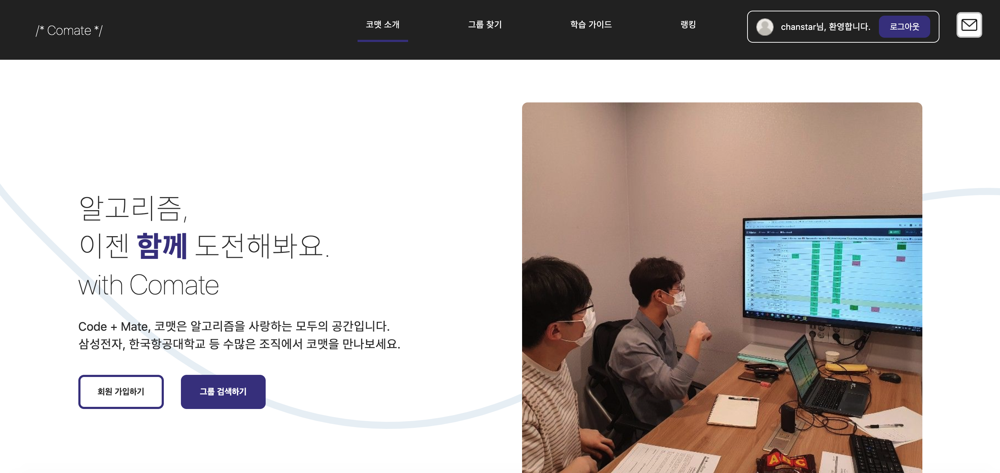
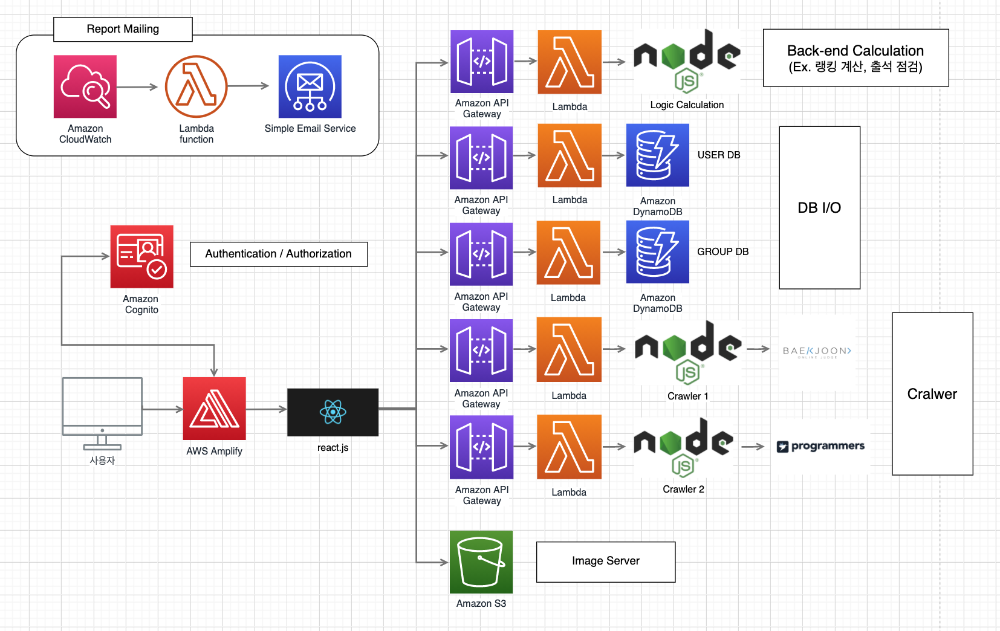

<h1 style = "text-align: center">
한국항공대 산학프로젝트 I : 함께 푸는 알고리즘, 코맷
</h1>

## 🌟 Comate : 서버리스 백엔드를 활용한 알고리즘 스터디 서비스

## 👇🏻 서비스 링크

[바로가기](https://main.dgm2h3gefx045.amplifyapp.com/)

## 📷 스크린샷

## ⚙️ 아키텍처

## 📌 팀원 정보

🧸 그룹 데이터베이스 제작 및 REST API 배포 - 김지인 [@jane-k](https://github.com/jane-k)

😆 클라이언트 UI 제작 - 김찬민 [@c17an](https://github.com/c17an)

👨 출석 및 문제 추천 기능 제작 - 김태현 [@kimtaehyun98](https://github.com/kimtaehyun98)

🐨 계정 인증 및 권한 관리 - 천수환 [@suhwan-cheon](https://github.com/suhwan-cheon)

👨🏻‍💻 유저 API 데이터베이스 - 이은현 [@SongGol](https://github.com/SongGol)

## 🛠 사용 기술

- ### **프론트엔드**

  

    

    

- ### **형상 관리**

    

    

- ### **백엔드**

    
    

- ### **기타**

    
    
